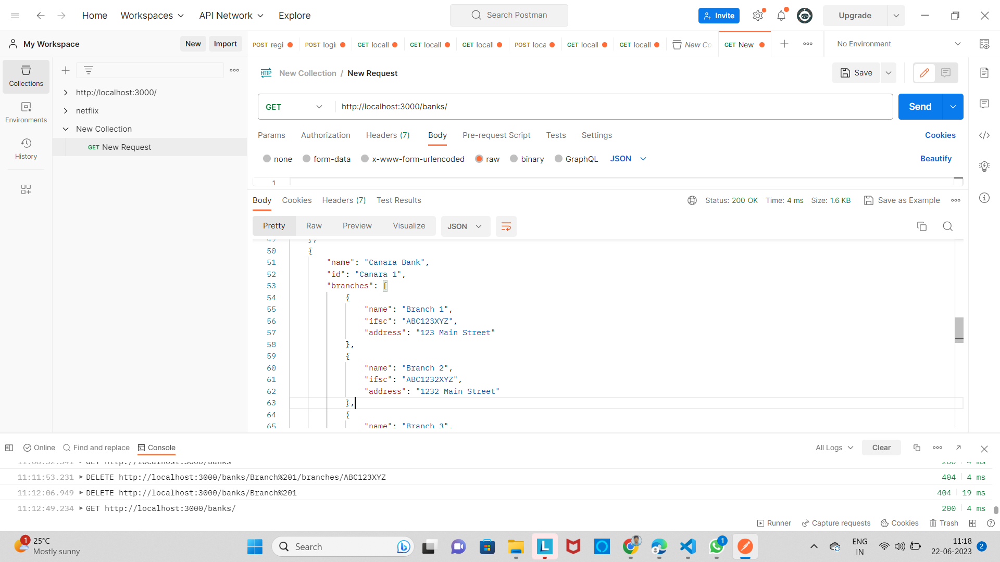
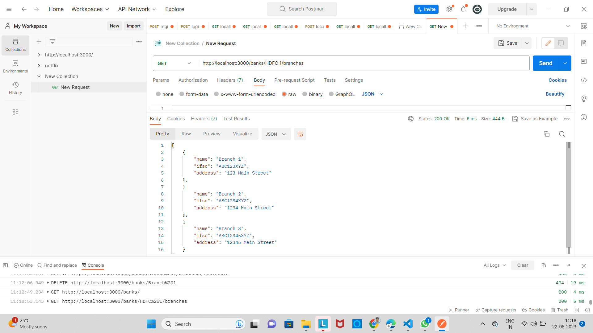
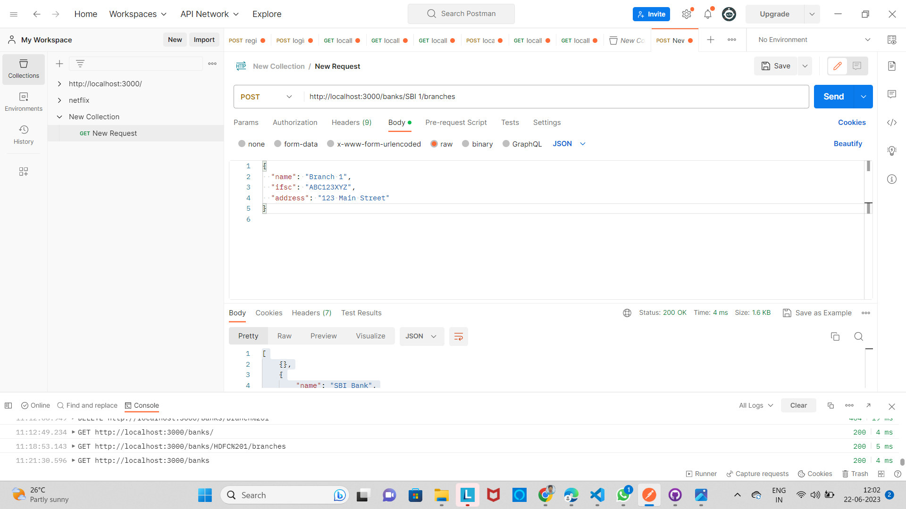

Bank API Server

This project implements a RESTful API server for managing banks and their branches. It provides CRUD (Create, Read, Update, Delete) operations for banks and their branches through various endpoints.

Installation
Clone this repository to your local machine.

Install the required dependencies by running the following command:
npm install

USAGE

Start the API server by running the following command:
npm start,
The server will start running on port 3000.

You can use a tool like Postman to test the API endpoints. Here are some of the available endpoints:

GET /banks: Retrieve a list of all banks.

GET /banks/:bankId: Retrieve details of a specific bank.

POST /banks: Create a new bank.

PUT /banks/:bankId: Update details of a specific bank.

DELETE /banks/:bankId: Delete a specific bank.

GET /banks/:bankId/branches: Retrieve branches of a specific bank.

POST /banks/:bankId/branches: Add a new branch to a specific bank.

PUT /banks/:bankId/branches/:branchId: Update details of a specific branch.

DELETE /banks/:bankId/branches/:branchId: Delete a specific branch.

Use the appropriate HTTP methods and request payloads to interact with the API endpoints.

Examples
Here are some examples of how to use the API endpoints:

To retrieve a list of all banks:
GET http://localhost:3000/banks

To create a new bank:
POST http://localhost:3000/banks
Request Body: { "name": "SBI Bank" }

To update details of a specific bank:
PUT http://localhost:3000/banks/:bankId
Request Body: { "name": "Updated Bank Name" }

To delete a specific bank:
DELETE http://localhost:3000/banks/:bankId

Contributing
Contributions are welcome! If you find any issues or have suggestions for improvements, please open an issue or submit a pull request.

License
This project is licensed under the MIT License.

Acknowledgments

Express - Fast, unopinionated, minimalist web framework for Node.js.

Postman - API Development Environment.

